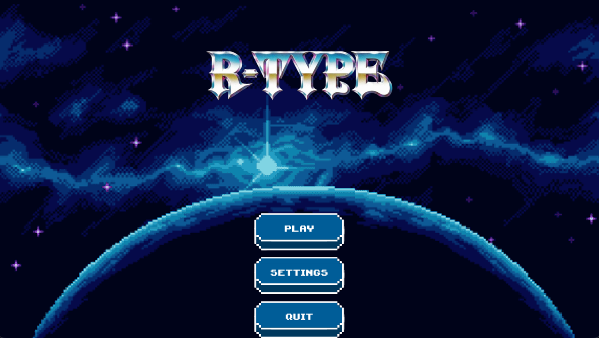

# UI Menus & Navigation

## Purpose

The client is split into multiple UI “screens” (menus) and gameplay scenes. In your implementation, this is modeled with a **state machine**:

* `MenuState` (main menu)
* `RoomState` (room/lobby screen)
* `SettingsState` (settings screen)
* (later) `GameState` / in-game HUD, pause, etc.

The goal is to keep UI logic isolated, and switch screens cleanly without leaking gameplay code into menus.

---

## What it looks like in practice
## 

### State-driven UI (not a scene stack)

Instead of a `SceneManager` stack, the client uses:

* `IGameState` interface
* `StateManager` that owns a **current state** and an optional **pending state** (queued transition)

Minimal API (as implemented):

```cpp
class IGameState {
public:
    virtual ~IGameState() = default;
    virtual void onEnter() = 0;
    virtual void update(StateManager& manager, const InputFrame& frame) = 0;
    virtual void render() = 0;
};
```

`StateManager` does:

* `changeState(state)` → sets `_current` and calls `onEnter()`
* `queueState(state)` → schedules a transition at the end of the frame
* `queueQuit()` → requests quitting after update finishes

### Why “queueState” matters

Transitions happen **after** the current state update completes:

* prevents switching state in the middle of logic
* avoids use-after-free when UI objects are owned by the state

---

## Runtime integration (where states are used)

`ClientRuntime::runDisplay()` is the UI “heartbeat”:

1. `pollEvents(*eventBus)`
2. `eventBus.dispatch()` → fills `InputState`
3. `stateManager.update(input.consumeFrame())`
4. `stateManager.render()`

So every UI/menu state is **purely driven by `InputFrame`** + its own internal menu widgets.

---

## Main Menu → Room / Settings / Quit (MenuState)

`MenuState` owns a `Menu` object.

Flow:

* `MenuState::onEnter()` creates the menu and calls `menu->onEnter()`
* every tick:

  * `menu->update(frame)`
  * if `menu->wantsSettings()` → queue `SettingsState`
  * if `menu->wantsToStart()` → queue `RoomState`
  * if `menu->wantsToQuit()` → `manager.queueQuit()`

This makes `MenuState` a thin orchestrator: widget logic stays inside `Menu`.

---

## Room / Lobby (RoomState)

`RoomState` owns a `RoomMenu` and receives a `RoomManager` dependency.

Flow:

* `onEnter()` creates the menu and calls `layout()`
* every tick:

  * `roomMenu->update(frame)`
  * if `roomMenu->wantsBackToMenu()` → queue `MenuState`

This screen is the bridge between:

* UI selection (world/level, create/join)
* networking requests (through your RoomManager / network module)

---

## Settings Menu (SettingsState)

Same pattern as other states:

* state owns a `SettingsMenu`
* it reads `InputFrame` to update sliders/buttons
* it applies changes to subsystems (audio/rendering) immediately or via a shared settings struct

*(Your code snippet references `SettingsState` from `MenuState`, so it’s part of the designed flow.)*

---

## Input handling for menus

Menus do not consume raw SFML events directly.

Instead:

* SFML → emits typed events (`MouseMoved`, `MousePressed`, etc.) into `EventBus`
* runtime listeners update `InputState`
* menus receive a compact `InputFrame` each tick via `consumeFrame()`

This keeps UI code backend-agnostic and testable.

---

## Simple Diagram: Menu Navigation

```text
┌──────────────────────────┐
│        MenuState         │
│  - Menu (Play/Settings)  │
└───────┬───────────┬──────┘
        │           │
        │ wantsToStart()
        │           │ wantsSettings()
        ▼           ▼
┌────────────────┐  ┌───────────────────┐
│    RoomState   │  │   SettingsState   │
│ - RoomMenu     │  │ - SettingsMenu    │
│ - RoomManager  │  │ (audio/video/etc) │
└───────┬────────┘  └──────────┬────────┘
        │ wantsBackToMenu()    │ back/apply
        └───────────┬──────────┘
                    ▼
              ┌────────────┐
              │  MenuState │
              └────────────┘

Quit:
MenuState -> StateManager.queueQuit() -> runtime stops display loop
```

---

## Practical guidelines (based on your design)

* Keep each `*State` very small:

  * create menu widget(s) in `onEnter()`
  * `update()` only calls `menu->update(frame)` + checks “wantsX()” flags
  * `render()` only calls `menu->render()`
* Put UI layout and widget behavior inside `Menu`, `RoomMenu`, `SettingsMenu`
* Use `queueState()` for transitions (never switch immediately mid-update)

---

## Notes / possible improvements

* There is no `onExit()` hook in `IGameState` currently.

  * If you later need cleanup (stop music, save settings), you can add `onExit()` and call it before `changeState()`.
* If you want a pause menu “stack”, you can extend `StateManager` to support a stack.

  * For now, the queued single-state model is perfect for menus and simple flows.
