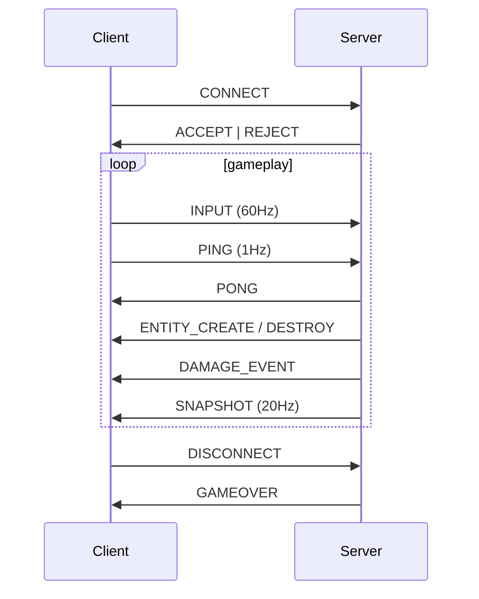

# **Binary Communication Protocol**

This page describes the **binary protocol** used between the **Client** and the **Server**.
All packets use the same header format and are encoded in a **compact, fixed-layout, big-endian friendly binary structure** to ensure:

* Low latency (UDP)
* Zero ambiguity
* Minimal overhead
* Cross-platform safety

Every packet uses:

```cpp
#pragma pack(push, 1)
struct PacketHeader {
    uint8_t type;     // packet type (enum)
    uint8_t version;  // protocol version
    uint16_t size;    // total size including header (htons)
};
#pragma pack(pop)
```

---

# **1. Packet Types**

All packets fall into two categories:

---

## **Client → Server**

Used for input, connection, heartbeat, etc.

| Name       | Code | Purpose                               |
| ---------- | ---- | ------------------------------------- |
| CONNECT    | 0x01 | Client requests to join the game      |
| INPUT      | 0x02 | Input state for the controlled entity |
| PING       | 0x03 | Heartbeat check                       |
| DISCONNECT | 0x04 | Client notifies exit                  |

---

## **Server → Client**

Used for world replication and gameplay events.

| Name           | Code | Purpose                               |
| -------------- | ---- | ------------------------------------- |
| ACCEPT         | 0x10 | Connection accepted                   |
| REJECT         | 0x11 | Connection refused                    |
| SNAPSHOT       | 0x12 | Full world snapshot for interpolation |
| ENTITY_CREATE  | 0x13 | Spawn an entity                       |
| ENTITY_DESTROY | 0x14 | Destroy an entity                     |
| DAMAGE_EVENT   | 0x15 | Entity took damage                    |
| GAMEOVER       | 0x16 | End of the game                       |
| PONG           | 0x17 | Response to PING                      |

---

# **2. Client → Server Packet Formats**

---

## **2.1. CONNECT**

Sent when a client joins the server.

```cpp
#pragma pack(push, 1)
struct PacketConnect {
    PacketHeader header;
    uint32_t clientId; // htonl, 0 if new connection
};
#pragma pack(pop)
```

---

## **2.2. INPUT**

Sent ~60 times per second.

```cpp
#pragma pack(push, 1)
struct PacketInput {
    PacketHeader header;
    uint32_t entity;    // htonl (the controlled entity)
    float    dx;        // movement axis
    float    dy;        // movement axis
    uint8_t  shooting;  // 0 or 1
};
#pragma pack(pop)
```

---

## **2.3. PING**

```cpp
#pragma pack(push, 1)
struct PacketPing {
    PacketHeader header;
};
#pragma pack(pop)
```

---

## **2.4. DISCONNECT**

```cpp
#pragma pack(push, 1)
struct PacketDisconnect {
    PacketHeader header;
};
#pragma pack(pop)
```

---

# **3. Server → Client Packet Formats**

---

## **3.1. ACCEPT**

Sent after successful CONNECT.

```cpp
#pragma pack(push, 1)
struct PacketAccept {
    PacketHeader header;
    uint32_t assignedId; // server-assigned client ID (htonl)
};
#pragma pack(pop)
```

---

## **3.2. REJECT**

```cpp
#pragma pack(push, 1)
struct PacketReject {
    PacketHeader header;
};
#pragma pack(pop)
```

---

## **3.3. ENTITY_CREATE**

```cpp
#pragma pack(push, 1)
struct PacketEntityCreate {
    PacketHeader header;
    uint32_t id;     // htonl
    float    x;
    float    y;
    uint16_t sprite; // htons (sprite ID)
};
#pragma pack(pop)
```

---

## **3.4. ENTITY_DESTROY**

```cpp
#pragma pack(push, 1)
struct PacketEntityDestroy {
    PacketHeader header;
    uint32_t id; // htonl
};
#pragma pack(pop)
```

---

## **3.5. DAMAGE_EVENT**

```cpp
#pragma pack(push, 1)
struct PacketDamage {
    PacketHeader header;
    uint32_t id;      // entity taking damage (htonl)
    uint16_t amount;  // damage applied (htons)
};
#pragma pack(pop)
```

---

## **3.6. SNAPSHOT**

Used for:

* interpolation
* client-side smoothing
* full replication of entity states

### Per-entity structure:

```cpp
#pragma pack(push, 1)
struct SnapshotEntity {
    uint32_t id;      // htonl
    float    x;
    float    y;
    float    vx;
    float    vy;
    uint16_t sprite;  // htons
};
#pragma pack(pop)
```

### Full packet:

```cpp
#pragma pack(push, 1)
struct PacketSnapshot {
    PacketHeader header;
    uint32_t tick;         // htonl (server tick)
    uint16_t entityCount;  // htons
    SnapshotEntity entities[]; // flexible array
};
#pragma pack(pop)
```

---

# **4. Overview of Communication Flow**

### Mermaid Diagram



---

# **5. Encoding Rules**

* All integers (`uint16_t`, `uint32_t`) use:

    * `htons`
    * `htonl`

* Structs are packed using:

```cpp
#pragma pack(push, 1)
...
#pragma pack(pop)
```

* Floats are transmitted **as-is (IEEE 754)**.
* No pointers, no padding, no variable alignment.

---

# **6. Validating Packets**

The server validates:

✔ packet size
✔ valid type
✔ correct version
✔ expected minimum size
✔ entity ID exists
✔ input values are normalized

Malformed packets are **ignored silently** to protect the server.

# **7. Binary Layout Reference (Byte-level)**

This section describes the **exact byte layout** of each packet on the wire.

All offsets are **relative to the beginning of the packet**.

---

## **7.1 Packet Header (Common to all packets)**

| Offset |  Size | Type   | Name    | Description               |
| -----: | ----: | ------ | ------- | ------------------------- |
|      0 |     1 | uint8  | type    | Packet type enum          |
|      1 |     1 | uint8  | version | Protocol version (1)      |
|      2 |     2 | uint16 | size    | Total packet size (htons) |
|  **—** | **4** |        |         | **Header total size**     |

---

## **7.2 CONNECT (Client → Server)**

```cpp
struct PacketConnect {
    PacketHeader header;
    uint32_t clientId;
};
```

| Offset |  Size | Type   | Name     | Description                 |
| -----: | ----: | ------ | -------- | --------------------------- |
|      0 |     1 | uint8  | type     | CONNECT (0x01)              |
|      1 |     1 | uint8  | version  | Protocol version            |
|      2 |     2 | uint16 | size     | Total size = 8              |
|      4 |     4 | uint32 | clientId | Client ID (0 if new, htonl) |
|  **—** | **8** |        |          | **Packet total size**       |

---

## **7.3 INPUT (Client → Server)**

```cpp
struct PlayerInputData {
    HeaderData header; ///> The packet header containing type, version, and size.
    uint8_t flags;     ///> Bitwise flags representing player inputs:
                       ///  Bit 0: Up
                       ///  Bit 1: Down
                       ///  Bit 2: Left
                       ///  Bit 3: Right
                       ///  Bit 4: Shoot
};
```

| Offset |   Size | Type   | Name     | Description                  |
| -----: | -----: | ------ | -------- | ---------------------------- |
|      0 |      1 | uint8  | type     | INPUT (0x02)                 |
|      1 |      1 | uint8  | version  | Protocol version             |
|      2 |      2 | uint16 | size     | Total size = 18              |
|      4 |      4 | uint32 | entity   | Controlled entity ID (htonl) |
|      8 |      4 | float  | dx       | Movement X axis              |
|     12 |      4 | float  | dy       | Movement Y axis              |
|     16 |      1 | uint8  | shooting | 0 or 1                       |
|  **—** | **17** |        |          | **Packet total size**        |

⚠️ Note: Some compilers may pad to 18 bytes — packing is mandatory.

---

## **7.4 ENTITY_CREATE (Server → Client)**

```cpp
struct PacketEntityCreate {
    PacketHeader header;
    uint32_t id;
    float x;
    float y;
    uint16_t sprite;
};
```

| Offset |   Size | Type   | Name    | Description           |
| -----: | -----: | ------ | ------- | --------------------- |
|      0 |      1 | uint8  | type    | ENTITY_CREATE (0x13)  |
|      1 |      1 | uint8  | version | Protocol version      |
|      2 |      2 | uint16 | size    | Total size = 16       |
|      4 |      4 | uint32 | id      | Entity ID (htonl)     |
|      8 |      4 | float  | x       | World X position      |
|     12 |      4 | float  | y       | World Y position      |
|     16 |      2 | uint16 | sprite  | Sprite ID (htons)     |
|  **—** | **18** |        |         | **Packet total size** |

---

## **7.5 SNAPSHOT (Server → Client)**

### SnapshotEntity layout

```cpp
struct SnapshotEntity {
    uint32_t id;
    float x;
    float y;
    float vx;
    float vy;
    uint16_t sprite;
};
```

| Offset |   Size | Type   | Name   |
| -----: | -----: | ------ | ------ |
|      0 |      4 | uint32 | id     |
|      4 |      4 | float  | x      |
|      8 |      4 | float  | y      |
|     12 |      4 | float  | vx     |
|     16 |      4 | float  | vy     |
|     20 |      2 | uint16 | sprite |
|  **—** | **22** |        |        |

---

### PacketSnapshot layout

```cpp
struct PacketSnapshot {
    PacketHeader header;
    uint32_t tick;
    uint16_t entityCount;
    SnapshotEntity entities[];
};
```

| Offset | Size | Type   | Name        |
| -----: | ---: | ------ | ----------- |
|      0 |    4 | Header | header      |
|      4 |    4 | uint32 | tick        |
|      8 |    2 | uint16 | entityCount |
|     10 | N×22 | struct | entities[]  |

Total size formula:

```
size = 10 + (entityCount × 22)
```